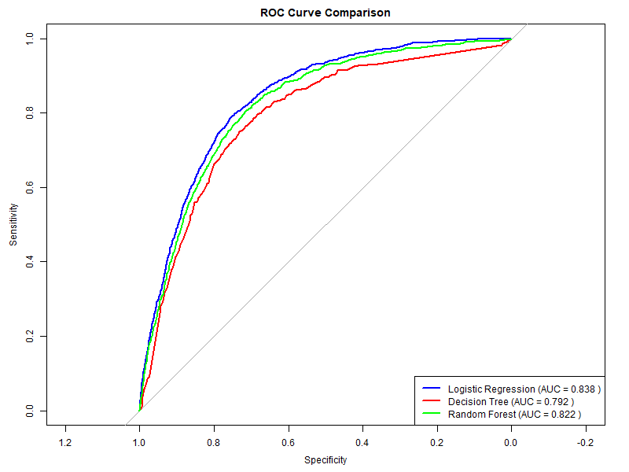
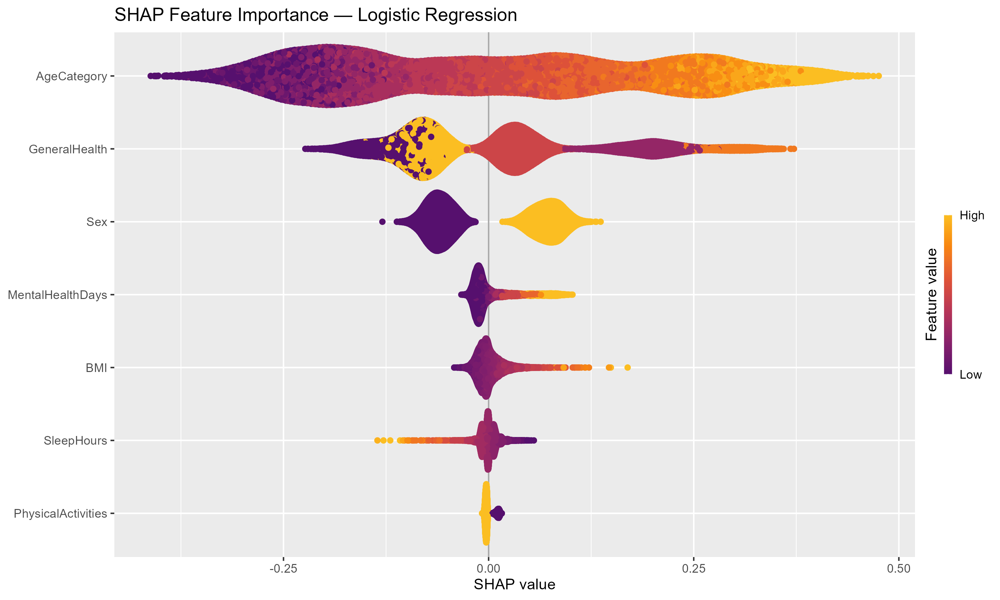

# Predicting Heart Disease Risk from Sleep Duration in COVID-Positive Adults

## Overview
This project investigates whether sleep duration predicts heart disease
in adults who have tested positive for COVID-19, using the
[CDC BRFSS 2022 dataset][(https://www.cdc.gov/brfss/annual_data/annual_2022.html).](https://www.kaggle.com/datasets/kamilpytlak/personal-key-indicators-of-heart-disease/data).
Three models: logistic regression, decision tree, and random forest, 
were benchmarked using 5-fold cross-validation on a stratified 80/20 split.

## Key Results
- **Best model:** Logistic regression (AUC = 0.838, sensitivity = 80.5%)
- Class imbalance addressed via downsampling within training folds
- SHAP analysis provided individual-level feature importance

### ROC Curve Comparison

### SHAP Feature Importance

## Methods
- Missing data: listwise deletion for SleepHours (primary predictor);
  median imputation for BMI and MentalHealthDays
- Evaluation metrics: AUC and sensitivity prioritised over accuracy
  due to class imbalance and the asymmetric cost of false negatives
  in a screening context

## Tools
R · tidyverse · caret · rpart · randomForest · pROC · fastshap · shapviz · corrplot

## Data
The BRFSS 2022 dataset is publicly available from Kaggle
(https://www.kaggle.com/datasets/kamilpytlak/personal-key-indicators-of-heart-disease/data)
It is not included in this repository due to file size.
